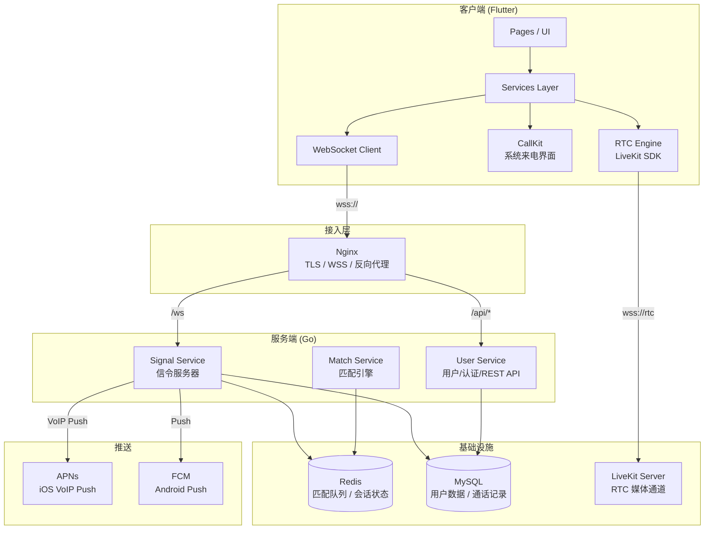
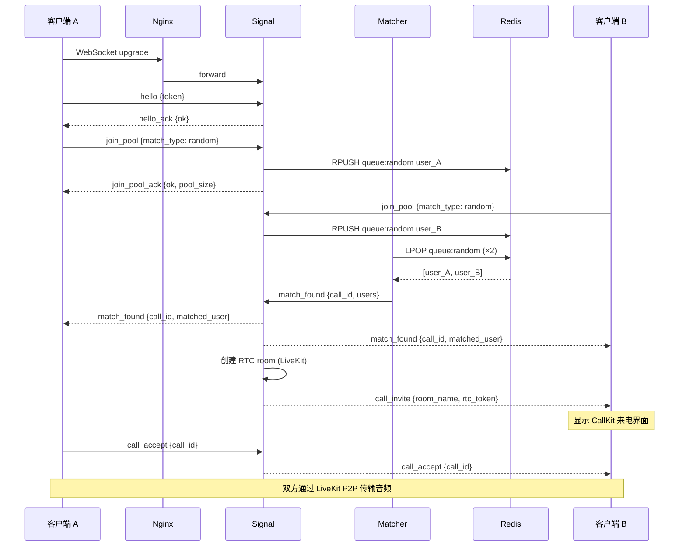
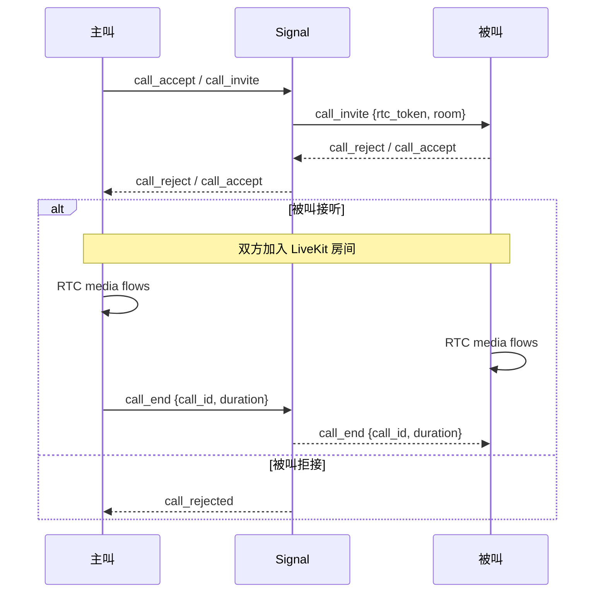

# VoiceMatch 系统架构

## 1. 系统总览

## 2. 模块职责

| 模块 | 职责 | 依赖 |
|---|---|---|
| **Signal Service** | 维护 WebSocket 长连接，处理 hello/heartbeat、转发呼叫信令 (call_invite/accept/reject/end)、ICE candidate 透传 | Redis (会话状态), MySQL (用户校验) |
| **Match Service** | 从 Redis List 中 LPOP 两个用户进行匹配，生成 call_id 并通知双方 | Redis (匹配队列) |
| **User Service** | 提供 REST API：Apple/手机号登录、资料 CRUD、偏好设置、通话记录、举报/拉黑 | MySQL, Redis (JWT 黑名单) |
| **LiveKit Server** | 托管 WebRTC 房间，处理音频流转发，NAT 穿透 | 独立部署 |
| **Nginx** | TLS 终止、WebSocket Upgrade、REST 反向代理 | Signal, User |

## 3. 数据流：匹配流程

## 4. 数据流：通话流程

## 5. 技术选型理由

| 技术 | 选择理由 |
|---|---|
| **Go (服务端)** | Goroutine 天然适配 WebSocket 长连接，单机可支撑 10w+ 并发连接；编译为静态二进制，Docker 镜像小 (~20MB)；生态成熟 (gorilla/websocket, go-redis, GORM) |
| **Flutter (客户端)** | 一套代码同时覆盖 iOS/Android，降低双倍开发成本；livekit_client 和 flutter_callkit_incoming 均有成熟 Flutter 插件 |
| **LiveKit (RTC)** | 开源 WebRTC SFU，自托管可控；相比 Agora 无需按分钟付费；自带 iOS/Android SDK、DTLS/SRTP 加密、拥塞控制 |
| **Redis (匹配/状态)** | List 数据结构天然适合 FIFO 匹配队列；Pub/Sub 用于跨节点消息广播；O(1) 查找用户会话状态 |
| **MySQL (持久化)** | 用户资料、通话记录等结构化数据，事务一致性保证；GORM ORM 开发效率高 |

## 6. 性能指标估算

| 指标 | 估算值 | 说明 |
|---|---|---|
| 单实例 Signal 并发连接 | ~50,000 | Go goroutine + epoll，每连接 ~4KB 栈内存，约 200MB 堆 |
| 单实例内存占用 (Signal) | ~300-500 MB | 连接管理 + Hub 注册表 |
| 单实例 Match QPS | ~2,000/s | Redis LPOP 操作，无 GC 压力 |
| LiveKit 房间音频并发 | ~200 房间 (1v1) | 每房间 2 路音频，带宽约 128kbps/路 |
| Nginx WSS 转发 | ~100,000 conn | 4-worker 进程，每 worker 25k |
| 目标部署规模 | 2 Node (8C16G) | 1×Signal + 1×Match + 1×LiveKit，负载均衡 |
